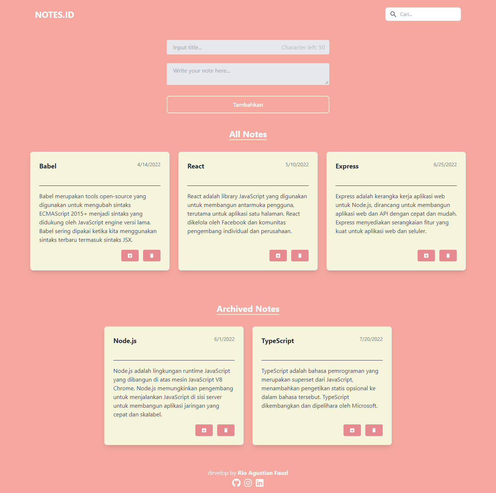

# Aplikasi Catatan React

Aplikasi Catatan React adalah aplikasi pencatat sederhana yang memungkinkan pengguna untuk menambahkan, mencari, mengarsipkan, dan menghapus catatan dengan mudah. Dibangun dengan React dan Tailwind CSS, aplikasi ini dirancang untuk memberikan pengalaman pengguna yang responsif dan intuitif di berbagai perangkat.

## Fitur

- **Tambah Catatan**: Pengguna dapat menambahkan catatan baru dengan judul dan isi.
- **Pencarian Catatan**: Pengguna dapat mencari catatan berdasarkan judul.
- **Arsip Catatan**: Catatan yang tidak lagi aktif dapat diarsipkan.
- **Hapus Catatan**: Pengguna dapat menghapus catatan yang tidak diperlukan lagi.
- **Desain Responsif**: Antarmuka pengguna yang adaptif untuk berbagai ukuran layar.

## Demo



###

For Demo of this template you can [Visit website](https://notes-app-delta-rust.vercel.app/)

## Instalasi

Untuk menggunakan aplikasi ini di komputer lokal Anda, ikuti langkah-langkah berikut:

1. **Clone repositori ini ke komputer Anda:**
   ```bash
   https://github.com/Rioagustianf/React-Notes-App.git
   ```
2. **Masuk ke direktori proyek:**
   ```bash
   cd nama_folder
   ```
3. **Instal dependensi proyek:**
   ```bash
   npm install
   ```
4. **Jalankan aplikasi:**

   ```bash
   npm run dev
   ```

   Happy coding😊
